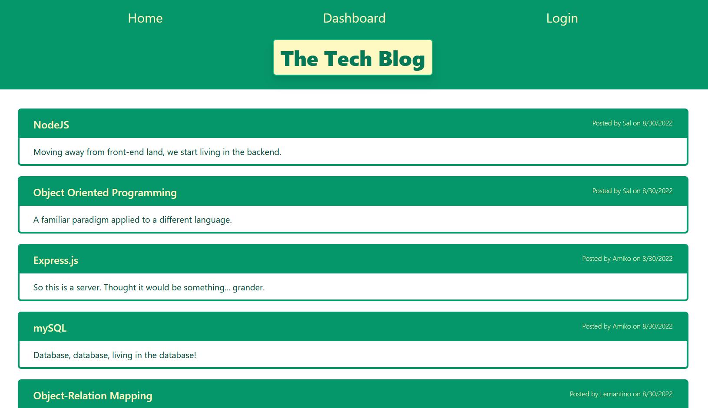
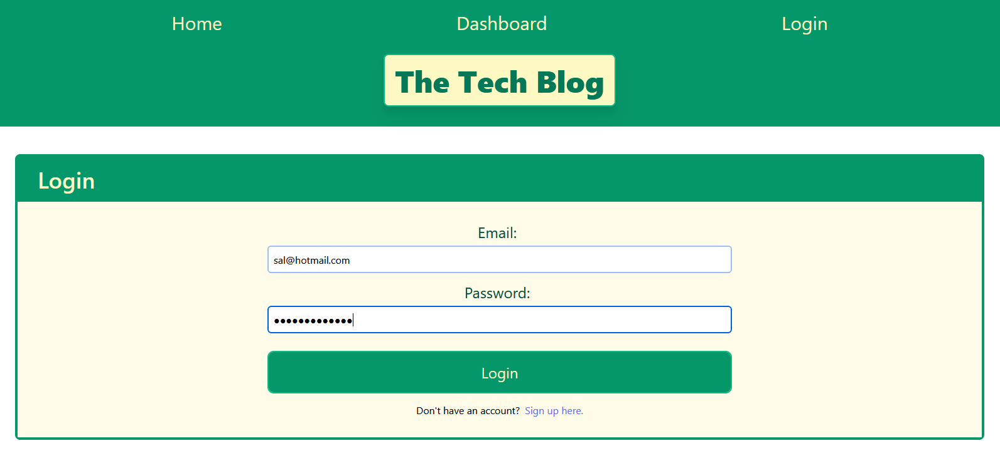
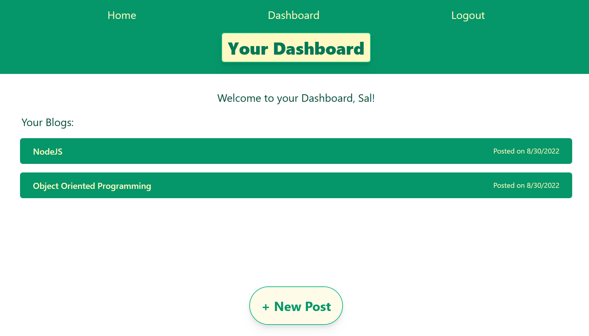
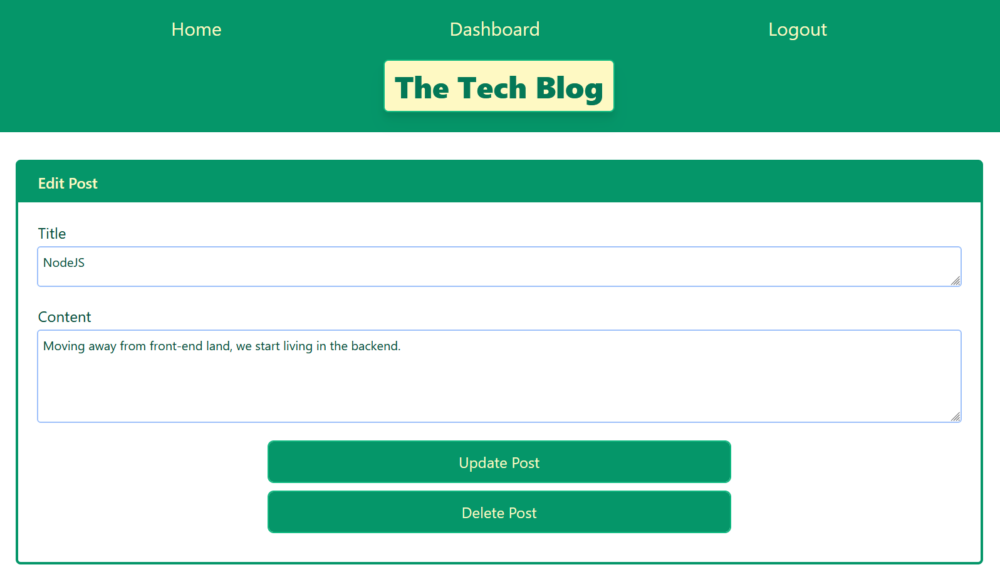
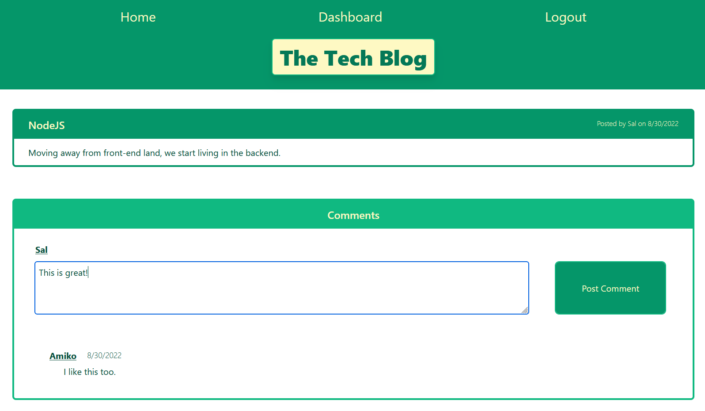

# Tech Blog  

## Description

This project is a blogging app that allows users to create an account, login, and post blog posts. This app uses a persistent database to store blog posts, comments, and users and displays them on different pages. A user can enter their dashboard to see their own blog posts, update, and delete blog posts. It allows users that haven't logged in to view the current blog posts and comments in the database by registered users. 

## Packages and Installation

This project uses sequelize, mysql2, express-handlebars, bcrypt, dotenv, express-session, and connect-session sequelize. Running 'npm install' with the current package.json in the file will install all dependencies. 

The program can be called using "node server.js" from the project directory, or accessed through the heroku deployment.

## Usage Instructions

A user will start on the home page. Before logging in, they may click on the blogs and see the comments others have posted, but cannot post comments of their own.

Upon clicking on dashboard or login, a user is prompted to login or signup. Doing either will direct the user to their dashboard, which will show the current blogs that user has made in the database. Clicking these blogs will allow a user to update or delete the blog. Upon doing either action, they will be directed back to the dashboard with an updated list of blogs.

A logged in user may now comment on blog posts from the homepage. Comments show up below the blog post and have a text box to input a new comment. Upon submitting a comment, the comment will show up in the list of comments below the blog post.

## Screenshots

* Front Page

* Login Page

* Dashboard Page

* Update/Delete Page

* A Blog With Comments

## License 

 

"Permissions of this strong copyleft license are conditioned on making available complete source code of licensed works and modifications, which include larger works using a licensed work, under the same license. Copyright and license notices must be preserved. Contributors provide an express grant of patent rights."

Read more about this license at: https://choosealicense.com/licenses/gpl-3.0/

## Credits

Thanks to https://github.com/eslint/eslint/issues/10137 for helping me implement linting into this project.

## Github Repository Link

GitHub Repository: https://github.com/voravichs/employee-tracker

